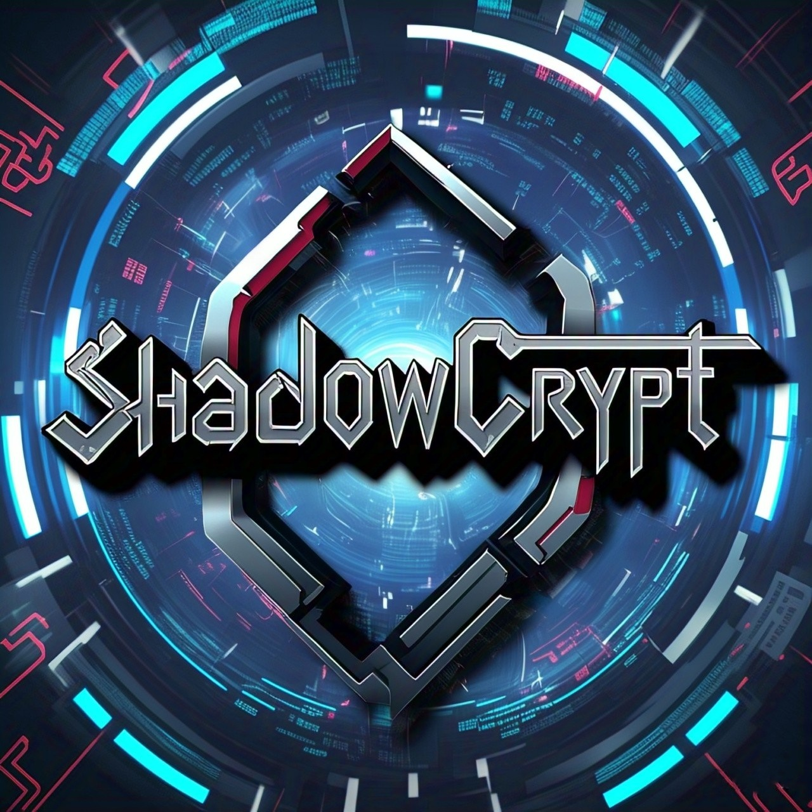

<div align="center">

# <span style="vertical-align: middle;"></span> ShadowCrypt



<br>

&nbsp;&nbsp;&nbsp;&nbsp;


  

</div>

<br>

### Proactive ransomware defense and secure file hiding for Windows. Effortlessly protect, access, and recover sensitive files using encrypted mappings and smart shortcuts.

<br>

## Original Research

This project is based on the research paper:

### 📄Hiding in the Crowd: Ransomware Protection by Adopting Camouflage and Hiding Strategy With the Link File
* **📌 Authors:** Soohan Lee et al.
* **📌 Published in:** IEEE ACCESS
* **📌 Original Implementation:** [hanXen/ransomware_protect_linker](https://github.com/hanXen/ransomware_protect_linker)
* 🔗 [Read the Full Paper Here](https://doi.org/10.1109/ACCESS.2023.3309879)

<br>

## **⭐ Underlying Concept**

This project leverages a key observation about ransomware behavior: it often avoids targeting system files (like `.exe` or `.dll`) and their directories (e.g., `Program Files`, `Windows`). The core idea, inspired by the original work, is to protect valuable data cost-effectively by camouflaging files with system-like extensions and hiding them within system file directories.

To maintain ease of access to these hidden files, this project utilizes Windows shortcut files (also known as link files), providing a seamless way for users to open and manage their protected data.

<br>

## Table of Contents

* [Original Research](#original-research)
* [About This Improved Project](#about-this-improved-project)
* [Prerequisites](#prerequisites)
* [Installation](#installation)
* [Usage](#usage)
* [Uninstallation](#uninstallation)
* [License](#license)
* [Acknowledgements](#acknowledgements)

<br>

## About This Improved Project

This project provides an enhanced and more user-friendly implementation of a proactive ransomware defense and secure file hiding solution for Windows. Building upon the foundational concepts, this improved version focuses on simplifying the user experience and expanding the functionality. Key enhancements include:

* **Improved Hiding Functionality:** Now supports hiding multiple selected files simultaneously with a streamlined shortcut creation process.
* **Enhanced Recovery Functionality:** Offers versatile recovery options, allowing users to recover:
    * Multiple selected hidden files.
    * All hidden files by searching the entire system.
    * Hidden files within a specific directory.
    * Hidden files within a specific directory and all its subdirectories (recursive recovery).
* **Right-Click Menu Integration:** Provides convenient right-click menu options for core functionalities, enabling easy access without the need for command-line interaction.
* **Simplified Setup:** Features an easy installation process via a standalone executable (available in the [releases](https://github.com/Raqeeb27/ShadowCrypt/releases).

This project aims to make robust ransomware defense and secure file management more accessible and efficient for Windows users.

<br>

## Prerequisites

To run this project on your Windows system, ensure the following are installed:

* **Python:** Version 3.12 or higher is required. You can download it from [here](https://www.python.org/downloads/).
* **PowerShell:** Windows PowerShell is typically pre-installed on modern Windows systems. Ensure it is enabled and accessible. If needed, you can download the latest version from [here](https://github.com/PowerShell/PowerShell/releases).
* **uv:** This package installer is required. You can install it using pip:
    ```bash
    pip install uv
    ```
<br>

**Install Supported Softwares (for broader file format support):**

This project supports secure hiding and recovery of various file formats by leveraging external applications. Installing these applications will ensure a seamless experience with a wider range of files:

* **LibreOffice:** (for documents, presentations, spreadsheets, PDFs) Download from [here](https://www.libreoffice.org/download/download-libreoffice/).
* **7-Zip:** (for archive formats) Download from [here](https://www.7-zip.org/download.html).
* **VLC Media Player:** (for audio and video files) Download from [here](https://www.videolan.org/vlc/).

**Note:** Ensure these applications are installed in their default locations for automatic path detection. You can optionally verify or manually configure the application paths later in the [`app_path.json`](db/app_path.json) file.

<br>

## Installation

> Before proceeding with the installation, please ensure you have the necessary [prerequisites](#prerequisites) installed.

⭐ **Easy Installation via Standalone Executable:** For the simplest installation, you can download and run the latest release of the project. Visit the [release page](https://github.com/Raqeeb27/ShadowCrypt/releases) to download the standalone executable. Running this will guide you through the installation process.

**Alternatively, you can install from the source code:**

1.  **Clone the repository:**
    ```bash
    git clone https://github.com/Raqeeb27/ShadowCrypt.git
    cd ShadowCrypt
    ```

2.  **Build the project and install dependencies:**
    ```powershell
    powershell -ExecutionPolicy Bypass -File install.ps1
    ```
    This script will:
    * Set up the necessary environment and install required dependencies.
    * **Prompt you to create a strong password** that meets minimum security requirements. This password will be used to encrypt the project's internal database. **Please remember this password carefully.**
    * Create executables for easier execution.

3.  **Set up Right-Click Menu Options (Run as Administrator):**
    To enable convenient right-click menu options for easy access to the project's functionalities, run the following batch script as an administrator :
    ```batch
    Set-RightClick.bat
    ```

<br>

## Usage

Once the installation is complete (either via the standalone executable or from the source code), you can easily interact with the project using the integrated right-click menu options. After selecting the desired option, you may encounter User Account Control (UAC) prompts; click "Yes" to proceed. A command window will then appear, prompting you to enter the password you set during the installation.

**Hiding/Recovering a Single File:**

* Right-click on the file you want to hide or recover.
* In the context menu (on Windows 11, you might need to click "Show more options"), select "**Hide File**" or "**Recover File**".

**Opening a Hidden File:**

* Simply double-click the shortcut link file that was created when the file was hidden.

**Hiding/Recovering Multiple Selected Files:**

* Select all the files you want to hide or recover.
* Right-click on any of the selected files (on Windows 11, you might need to click "Show more options").
* Navigate to "**Send to**" in the context menu.
* Choose "**Hide Selected Files**" or "**Recover Selected Files**" as needed.

**Recovering All Hidden Files:**

* Right-click on an empty area on your desktop or within any folder in File Explorer.
* Select "**Recover all files**" from the context menu.

**Recovering Hidden Files in the Current Folder:**

* Right-click on an empty area within the folder in File Explorer (on Windows 11, you might need to click "Show more options").
* Select "**Recover Files in This folder**" from the context menu.

**Recovering Hidden Files in the Current Folder and Subfolders (Recursive):**

* Right-click on an empty area within the folder in File Explorer (on Windows 11, you might need to click "Show more options").
* Select "**Recover Files Recursively (Include SubFolders)**" from the context menu.

<br>

## Uninstallation

**Important:** Before proceeding with uninstallation, ensure that you have recovered all your hidden files. The uninstallation process only removes the application and the right-click menu entries and **does not automatically recover your hidden data.**

**If you installed from source:**

To remove the right-click menu options from your system, run the following batch file as an administrator:

```batch
Remove-RightClick.bat
```

After running this script, you can manually delete the cloned repository folder if you wish to remove the project files entirely.

**If you installed via the standalone executable:**

1.  Uninstall the application through the Windows Control Panel (Add or Remove Programs or Apps & features, depending on your Windows version).
2.  Upon initiating the uninstallation, your browser will be redirected to an `Uninstall-README.md` file. Read [here](Uninstall-README.md)
3.  Follow the instructions in the `Uninstall-README.md` file to locate the `Remove-RightClickMenuOptions.bat` file.
4.  **Run the `Remove-RightClickMenuOptions.bat` file as an administrator** to remove the right-click menu options from your system.
5.  After running the batch file, the application files should be fully removed from your system by the uninstaller.

<br>

## License
This project follows the license of the original repository. See the [LICENSE](LICENSE) file for details.

<br>

## Acknowledgements

This project gratefully acknowledges the foundational work of the authors of the research paper "**Hiding in the Crowd: Ransomware Protection by Adopting Camouflage and Hiding Strategy With the Link File**" and the initial implementation by [hanXen](https://github.com/hanXen). Their research provided the inspiration and improvements for this project.
